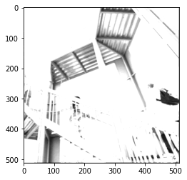

# Informal Response 3 (2/18/2021)

[Back to Home Page](https://jeremy-swack.github.io/applied-machine-learning/)

## Three Chosen Filters:

```
filter = [ [1, 1, 0], [1, -2, 1], [2, 1, 0]]
```

This first filter results in this image:


