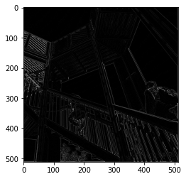

# Informal Response 3 (2/18/2021)

[Back to Home Page](https://jeremy-swack.github.io/applied-machine-learning/)

## The Original Image


## Three Chosen Filters:

```
filter = [ [1, 0, 0], [0, -1, 0], [0, 0, 1]]
```

This first filter results in this image:


This filter appears to make the image slightly more blurry.

```
filter = [ [0, -1, 0], [-1, 4, -1], [0, -1, 0]]
```



This filter appears to accentuate the diagonal lines found in the top left of the picture.
