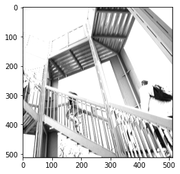

# Informal Response 3 (2/18/2021)

[Back to Home Page](https://jeremy-swack.github.io/applied-machine-learning/)

## The Original Image


## Three Chosen Filters:

```
filter = [ [1, 0, 0], [0, -1, 0], [0, 0, 1]]
```

This first filter results in this image:


This filter appears to make the image slightly more blurry.

```
filter = [ [0, -1, 0], [-1, 4, -1], [0, -1, 0]]
```


This filter appears to accentuate the diagonal lines found in the top left of the picture.

```
filter = [ [0, -2, 0], [1, 0, 1], [1, 0, 2]]
```



This final filter appears to make the entire image lighter.

## Q: What are you functionally accomplishing as you apply the filter to your original array?

Using filters and convolutions adds certain values to each value of the image array which changes the color of individual cells (assuming the value in the filter array is greater than 0). The filter is added to every single 3x3 set of pixels in the image array. 

## Q: Why is the application of a convolving filter to an image useful for computer vision?

A convolving filter allows for detection of indiviual features or characteristics of an image. Like in our example, some of the filters picked up on there being vertical, horizontal, or diagonal lines. This idea could be applied to the fashion MNST data set to tell that a shoe has a sole for example.

## Pooling
