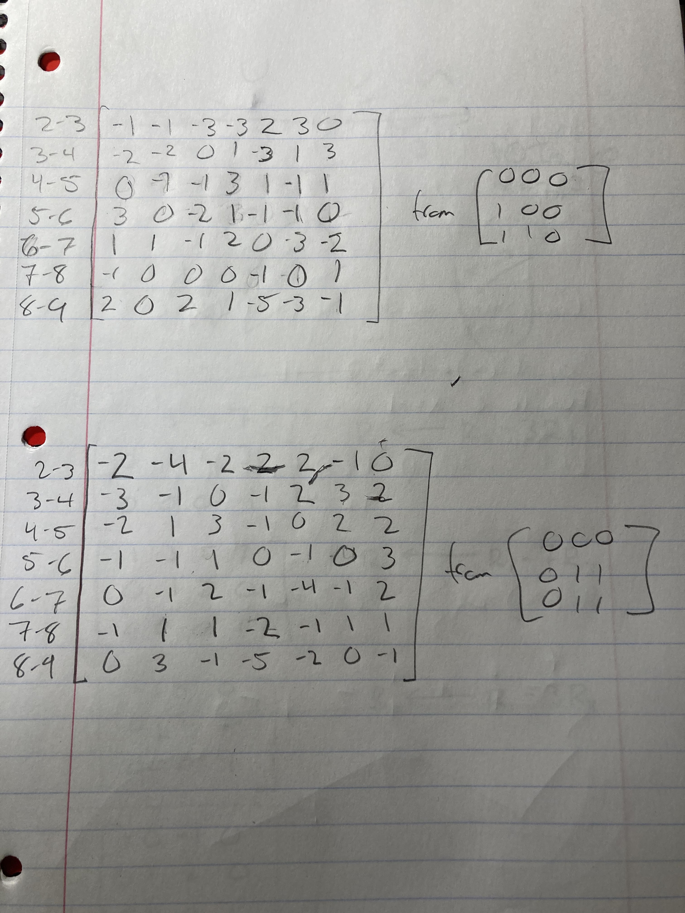

# Informal Response 4 (2/16/2021)

[Back to Home Page](https://jeremy-swack.github.io/applied-machine-learning/)

# Convolution Exercise 

## What is the purpose of using a 3x3 filter to convolve across a 2D image matrix?

Putting a 3x3 filter on an image can highlight certain features in the image itself. For example, in our previous example with the outdoor staircase, different filters were able to highlight different kinds of lines found in the image.

## Why would we include more than one filter?

Multiple filters could transform the image in a different way that one filter could. As long as the weight is correctly, it is possible to continually add filters on an image.

## How many filters did you assign as part of your architecture when training a model to learn images of numbers from the mnist dataset?

For the mnist dataset, we used 3 different filters, but the original image was reset for each filter. Each filter was a 3x3 matrix, so in total, 9 different adjustments to the original image had to be made.

# Zillow Prediction Exercise

## The 10 biggest over-predictions

MSE: 1.13288279739128e+22

## The 10 biggest under-predictions

MSE: 2.9951518470582574e+18

## The 10 best predictions

MSE: 5.429144865638734e+17

## In which percentile do the 10 most accurate predictions reside? Did your model trend towards over or under predicting home values?

The price percentiles of the 10 best predictions appear to be from around the 5th percentile to almost the 95th percentile. This wide range is caused by one very expensive house receiving an accurate prediction. The model trended towards overprediction as a majority of the prediction values are positive.

## Which feature appears to be the most significant predictor in the above cases?

The most significant predictor appears to be bathrooms. Loosely, there is a correlation between the number of bathrooms and the quality of the prediction. Performing a tSNE or PCA analysis would allow us to find this answer.
