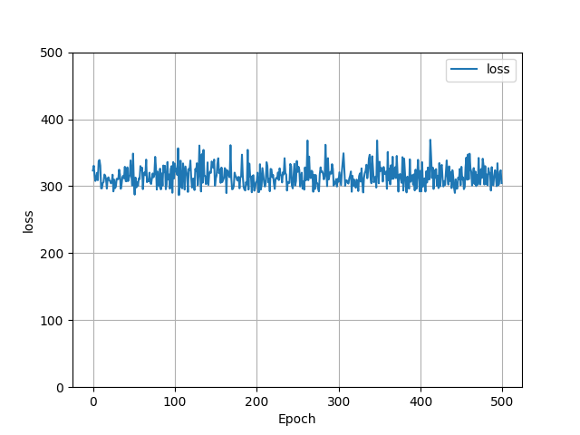
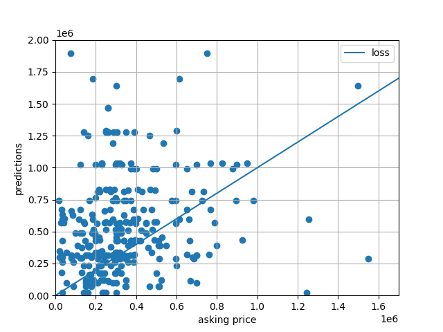

# Project 1: Beating the Zillow Zestimate 

[Back to Home Page](https://jeremy-swack.github.io/applied-machine-learning/)

## Project Report 

The Chicago housing data scraped from Zillow contains 5 different features: The asking price, the address, the number of beds, the number of bathrooms, and the total square footage. The raw data contained html tags and other characters other that were not of use, so the data was cleaned using the gsub() command in R. 

After cleaning the data, I used the number of beds, bathrooms, and total square footage to create a neural network to try and beat Zillow’s own “Zestimate.” Using tensorflow, I created a single dense layer neural network that took in these three features.. The plot below shows the learning of the neural network over 500 epochs.

From this plot, it is clear that this simple model was not very effective at predicting the asking prices of homes in Chicago. Although the graph is maybe slightly downward sloping, the trend is still very slight and shows that the model didn’t learn very much. The loss started around 330, and ended around 300, which is not ideal if the intention was to create a robust model that could provide accurate predictions. 

The plot above shows the accuracy of the model. Each point on the plot represents a recorded asking price on Zillow and the predicted price that came from the model. The 45 degree line on the plot shows a reference for what a perfect model would look like. In this case, it is clear the model did not do a good job of predicting asking prices, particularly for houses with relatively higher asking prices. There is a clear majority of points above the 45 degree line, which means the model generally overestimated the asking price of homes. 

Lastly, this final plot shows the MSEs (Mean Squared Error) for the model using 3 different scalers. 
