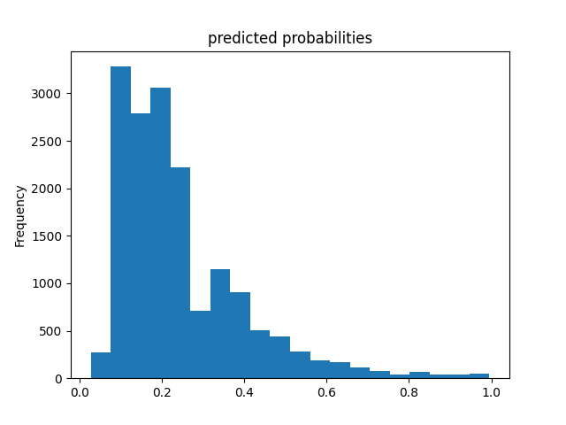
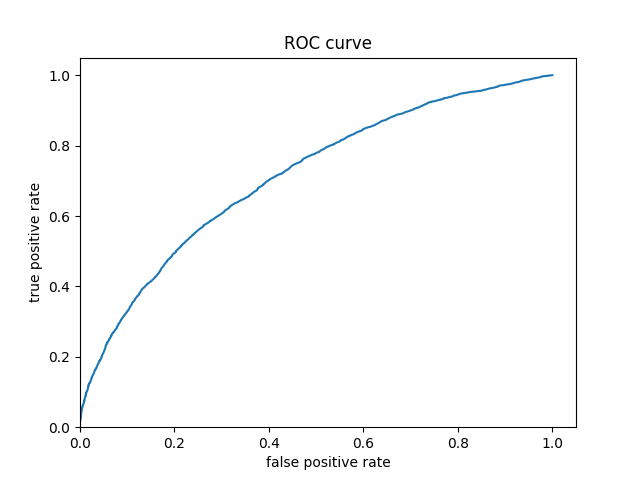
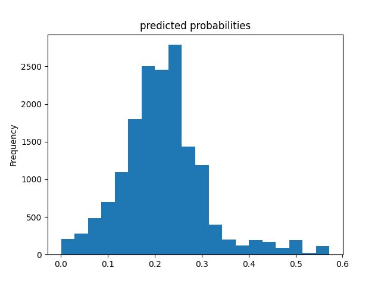
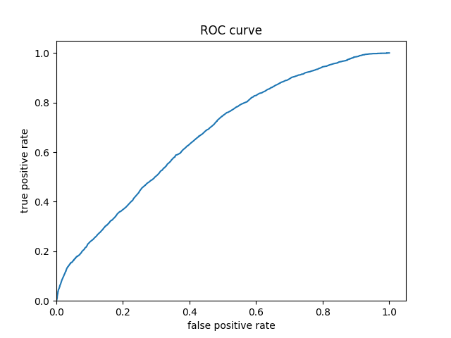

# Project 2: Modeling with DHS Data

[Back to Home Page](https://jeremy-swack.github.io/applied-machine-learning/)

## Background on the Data

For my project, I chose Egypt. The data is a Standard DHS from 2014. The resulting persons object from the data has roughly 65500 observations.

## R Script: Logistic Regression

As shown by the following plot, the model with the highest AUC is the third point with an area of .6305613.

I chose the penalty associated with the 11th point because the 11th point had a very high AUC while also having the largest penalty I could get without a substantial tradeoff in model performance. However, it is likely any of the first 11 points would result in a very comparable model.

Finally, below are the produced ROC plots for all 5 levels of wealth.

The model is clearly better at predicting levels 1 and 5, but there is still clear separation for levles 2-4 as well. This means there is more clear correlation between the variables we choose for our model and the highest and lowest levels of wealth. However, it is less clear for the middle values of wealth.

## R Script: Random Forest Ensemble

Below is a plot of the randomly selected predictors as well as the minimal node size.

After selecting the best possible model, I produced the ROC plots for the model.

These ROC plots are very similar to the logsitic regression ROC plots. Once again, the model is able to differentiate wealth levels 1 and 5 the best. However, it seems the random forest model is slightly better at differentiating between wealth level 2-4, but this difference is very slight at best.

## Python Script: Logistic Regression

After training the logistic model, I got the following characteristics:

| Name of Output | Value |
| --- | ----------- |
| Accuracy | 0.7856011 |
| average_loss | 0.48615587 |
| loss | 0.48615107 |
| global_step | 15380 |

After adding the derived feature columns:

| Name of Output | Value |
| --- | ----------- |
| Accuracy | 0.78365034 |
| average_loss | 0.48245367 |
| loss | 0.48246303 |
| global_step | 15380 |

Predicted probabilities plot for logistic regression:

ROC Curve for the logistic regression:

This ROC curve looks to be even farther away from 45 degrees than the previous ROC curves produced in the R scripts. This could mean the model is the best on average at predicting the level of wealth from our five selected variables.

## Python Script: Gradient Boosting Model using Decision Trees

After training the gradient boosting model, I got the following characteristics:

| Name of Output | Value |
| --- | ----------- |
| Accuracy | 0.778652 |
| accuracy_baseline  | 0.773470 |
| auc | 0.667933 |
| auc_precision_recall  | 0.370999 |
| average_loss  | 0.500747 |
| label/mean | 0.226530 |
| loss | 0.500747 |

Predicted probabilities plot for the boosted model:

ROC Curve for the boosted model:

This ROC curve appears to be closer to 45 degrees when compared to the others. However, the model still seems to be fairly comparable to the others

## Analyzing all the Models

Based on accuracy score, it appears the final boosted trees model in Python performed the best. However, all of the models perfromed extremely similarly. This is likely a result of only having a few variables to predict wealth. With more variables, particularly geospatial variables like from the GPS dataset we also pulled from DHS, it would probably be possible to create a model that performed better than the ones we created. It is also interesting to note in the R scripts how the ROC plots for the two models showed it was easier to differentiate between wealth levels 1 and 5 but not 2-4. This is likely because the poorest and wealthiest communites have more similar characteristics in their respective groups that allowed the models to pick up on the differences between them. Adding a geospatial component to the models would likely give a better chance of finding discrete differences between the middle wealth value groups.
