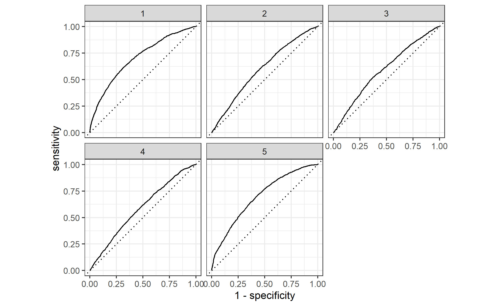

# Project 2: Modeling with DHS Data

[Back to Home Page](https://jeremy-swack.github.io/applied-machine-learning/)

## Background on the Data

For my project, I chose Egypt. The data is a Standard DHS from 2014. The resulting persons object from the data has roughly 65500 observations.

## R Script: Logistic Regression

As shown by the following plot, the model with the highest AUC is the third point with an area of .6305613.

I chose the penalty associated with the 3rd point because the 3rd point had the highest AUC. Because it has the largest AUC, it means that model was picking up the most correlation that could be found with th five given variables.

Finally, below are the produced ROC plots for all 5 levels of wealth.

The model is clearly better at predicting levels 1 and 5, but there is still clear separation for levles 2-4 as well. This means there is more clear correlation between the variables we choose for our model and the highest and lowest levels of wealth. However, it is less clear for the middle values of wealth.

## R Script: Random Forest Ensemble

Below is a plot of the randomly selected predictors as well as the minimal node size.

## Python Script: Logistic Regression

## Python Script: Gradient Boosting Model using Decision Trees

## Analyzing all the Models
