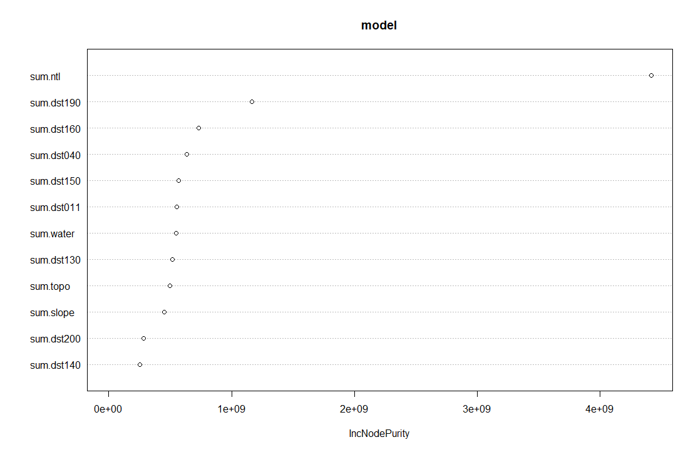
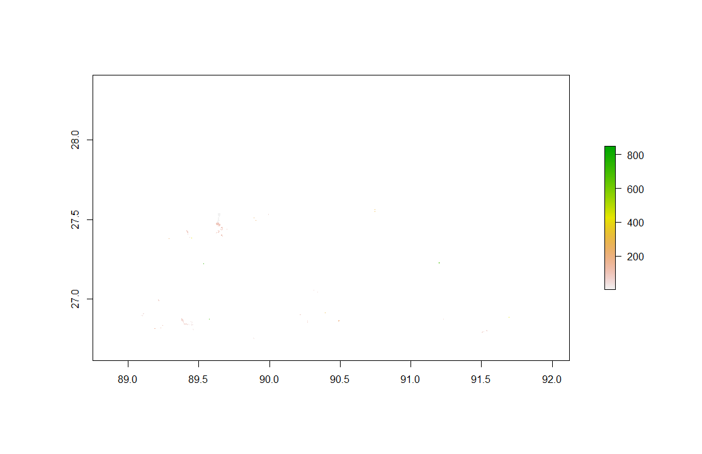
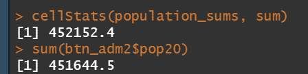
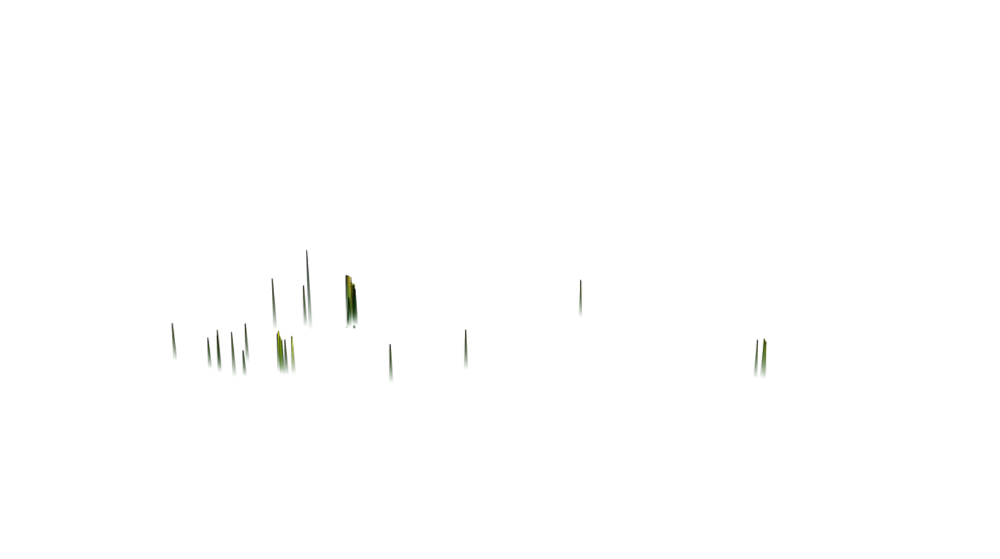

# Project 3: Applying Geospatial Covariates to predicting populations

[Back to Home Page](https://jeremy-swack.github.io/applied-machine-learning/)

## Background

For my project, I chose Bhutan, a landlocked Asian country. Part of the reason I chose was the country was because it was landlocked; dealing with islands can often be quite cumbersome. The country also has a relatively small area and population which allows the functions to be run on my laptop. Also, for all of my population plots, the rest of the country where population counts are low and predictions weren't made are not visible. Because of this, I have put a plot of the adm2 boundaries below for visual reference.

## Using two machine learning methods predict population values at 100 x 100 meter resolution throughout your selected country

### Linear Regression

Population Sums Plot:

Total Population Prediction:

#### Validation:

Difference Sums Plot:

3D Validation Plot:

3D Validation RMSE Plot:

### Random Forest

Variable Importance in Random Forest Model:

Population Sums Plot:

Total Population Prediction:

#### Validation:

Difference Sums Plot:

3D Validation Plot:

3D Validation RMSE Plot:

## Write a report assessing the two approaches and which of the two models was more accurate

Going strictly off the difference between the actual population of Bhutan and the predicted value, it appears the random forest model was slightly better than the linear regression, with the difference of the random forest model being about 500, and the difference of the linear model being about 600. However, both models predicted extremely close to the actual population. Both the linear regression and random forest plots underpredicted and overpredicted in slightly different areas. However, it seems the most populated parts of Bhutan are in the southwest region of the country. 

It is also interesting to note in the random forest model how night time lights is far and away the best variable at predicting population. However, this is not that surprisng considering that night time lights are a very good proxy for developed areas. Developed areas tend to have more people in them, hence why it is a very good variable for predicting population.

