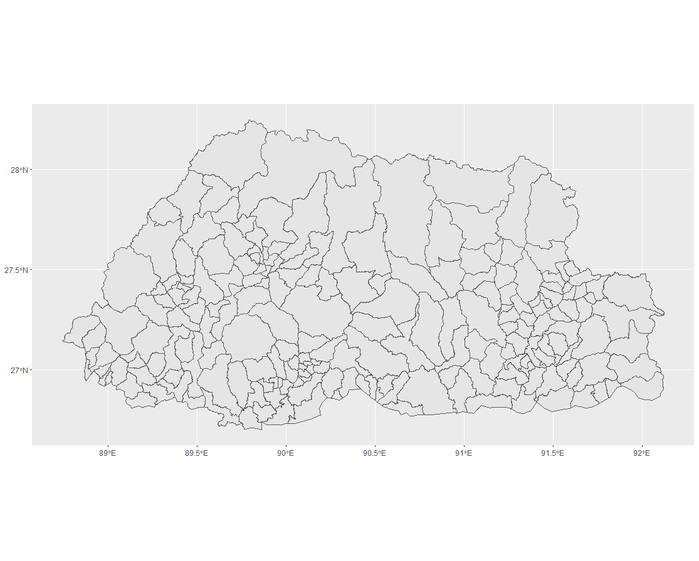
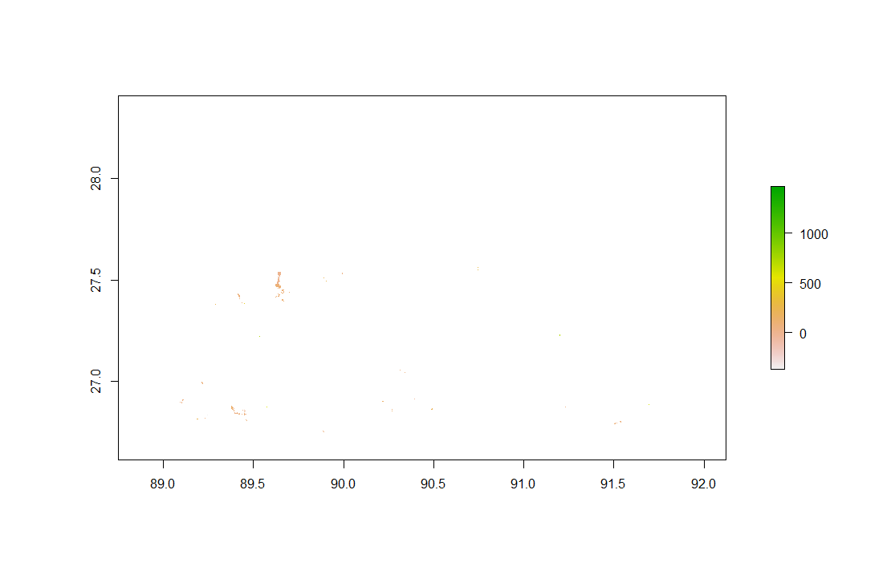
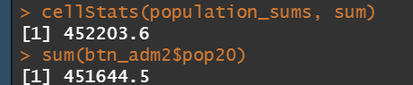
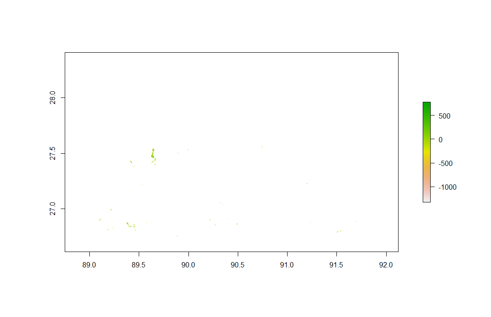
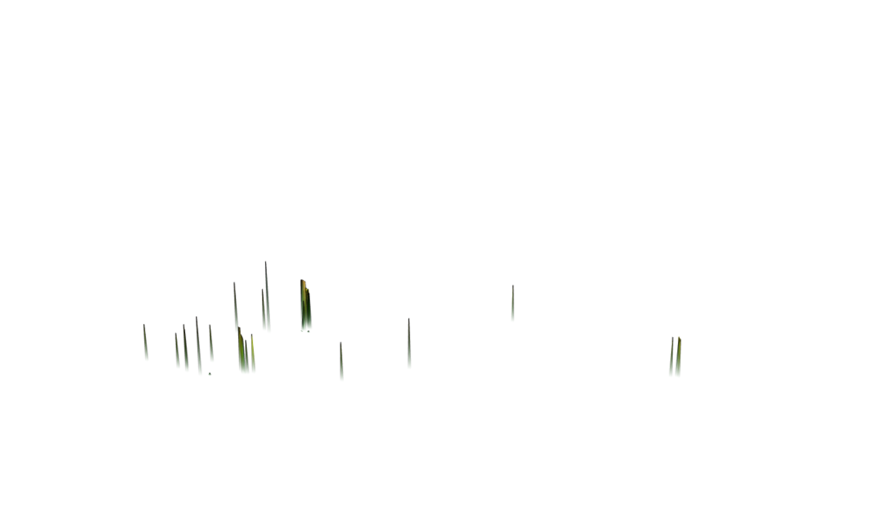
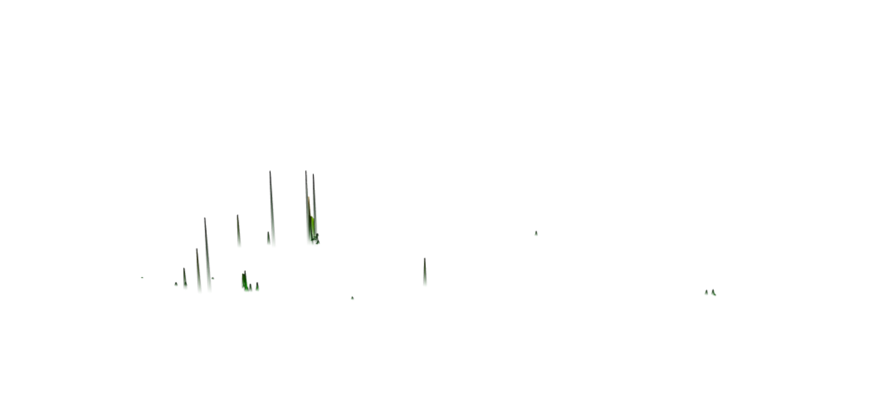

# Project 3: Applying Geospatial Covariates to predicting populations

[Back to Home Page](https://jeremy-swack.github.io/applied-machine-learning/)

## Background

For my project, I chose Bhutan, a landlocked Asian country. Part of the reason I chose was the country was because it was landlocked; dealing with islands can often be quite cumbersome. The country also has a relatively small area and population which allows the functions to be run on my laptop. Also, for all of my population plots, the rest of the country where population counts are low and predictions weren't made are not visible. Because of this, I have put a plot of the adm2 boundaries below for visual reference.

## Using two machine learning methods predict population values at 100 x 100 meter resolution throughout your selected country

### Linear Regression

Population Sums Plot:

Total Population Prediction:

#### Validation:

Difference Sums Plot:

3D Validation Plot:

3D Validation RMSE Plot:

### Random Forest

## Validate the two models using different methods presented in this class

## Write a report assessing the two approaches and which of the two models was more accurate

